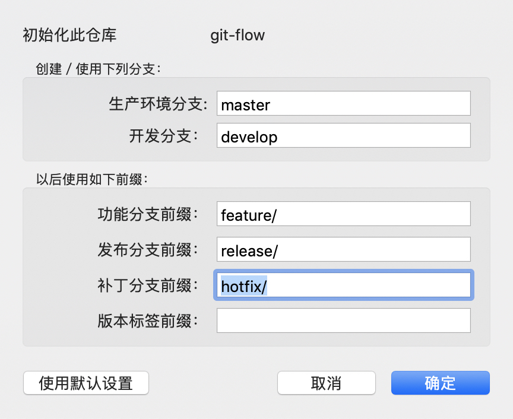

# GitFlowDemo
Git Flow实例演示

1. 在Github上创建一个项目，并设置好ssh

   https://github.com/sunwenquan/GitFlowDemo

2. clone项目

   ```
   git@github.com:sunwenquan/GitFlowDemo.git
   ```

3. 使用SourceTree打开项目

4. 仓库->Git flow->初始化仓库

   

5. 创建develop分支

   ```
   git branch develop
   git push -u origin develop  
   ```

6. 在develp分支开发新功能——introduction

   ```bash
   git checkout -b introduction develop
   git push -u origin introduction
   ```

7. 

